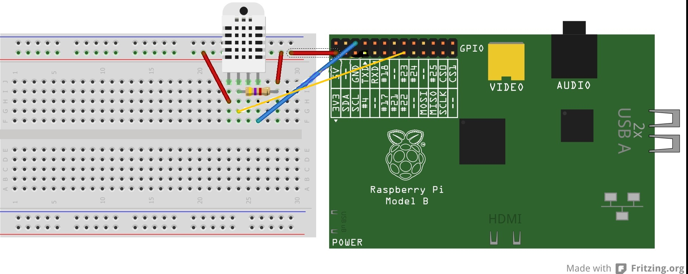

= CFPTEI_SERVEROOM
Loris De_Biasi LDB <loris.debiasi@gmail.com>;Samuel Cardoso SC <s.cardoso@threeangle.ch>; Kevin Amado KA <k.amado@email.com>; Dylan Wacker DW <d.wacker@email.com>
V1.0, 2016-03-09
:doctype: article
:encoding: utf-8
:lang: fr
:toc: left
:numbered:

== Solutions physiques

=== Introduction

Le rack est composé de trois serveurs HP DL360 G5 et un MSA 50.
On peut en extraire deux groupes distincts :

- Le groupe "Virtualisation" qui est composé de deux serveurs HP DL360 G5.
- Le groupe "Serveur de fichier" qui est composé d'un serveur HP DL360 G5 et d'un MSA 50.

=== Groupe "Virtualisation"

Ce groupe dispose de deux disques par serveur ceux-ci sont configurés en RAID 0. Ils contiennent la solution PROXMOX VE est représente un noeud de deux serveurs dans cette solution.

=== Groupe "Serveur de fichiers"
Le deuxième groupe est configuré en RAID 5 autant pour le serveur que pour le MSA. Le MSA contenant lui un disque de spare dans la baie qui s'occupera de répliquer les données d'un disque défaillant si une telle chose venait à se produire.

Le serveur contient la solution OPENFILER et permet de mettre à disposition à l'ensemble du réseau les capacités de stockage du MSA.

.Illustration des solutions présentes dans le rack informatique
[ditaa,diagRackInfo,png]
--
+------------------------+
|    RACK Informatique   |
|                        |
|    +-------------------+
|    | cBLU              |
|    |   VIRTUALISATION  |
|    |                   |
|    |    +--------------+
|    |    |cPNK          |
|    |    |     PVE01    | <--------+
|    |    |              |          :
|    +    +--------------+          |
|    |    |cPNK          |          |
|    |    |     PVE02    | <--------+  OPF01 met à disposition
|    |    |              |          |  les ressources du MSA
|    +----+--------------+          | 
|    | cBLU              |          |
|    |      SERVEUR DE   |          |
|    |       FICHIER     |          |
|    |                   |          |
|    |    +--------------+          |
|    |    |cPNK          |          :
|    |    |     OPF01    | ---------+
|    |    |              |
|    +    +--------------+
|    |    |cPNK          |
|    |    |     MSA      |
|    |    |              |
+----+----+--------------+
--

=== Raspberry PI - Sonde de Température

==== Prérequis
- Carte micro-SD
- Raspbian JESSIE : https://www.raspberrypi.org/downloads/raspbian/
- Win32 DiskImager : https://sourceforge.net/projects/win32diskimager/

==== Installation

1. Préparation de la carte SD 
Lancez Win32DiskImager sélectionner le fichier précédemment téléchargé et cliquer sur enregistrer et write.

3. Mise en route du Raspberry PI

Connectez la carte SD, le clavier, la souris, l'écran, le câble Ethernet et après cela alimenter le circuit.

Après que le raspberry est démarré (~30 secondes), le système demande des identifiants.
Le login par défaut est "pi", et le pasword est "raspberry". (Attention le clavier est configuré en QWERTY)

Si vous voulez reconfigurer par exemple le clavier ou la langue du système vous pouvez utiliser l'interface.
Pour faire apparaître l'interface permettant de faire des choix de configuration, il faut taper la commande : 

[source,bash]
----
sudo raspi-config
----

Pour mettre a jour le système et le redémarré, il faut taper la commande :

[source,bash]
----
sudo aptitude update -y && sudo aptitude upgrade -y && sudo reboot
----

Pour lancer l'interface graphique, il faut taper la commande :

[source, bash]
----
sudo startx
----

==== Capteur de température

===== Prérequis
 - Plaque d'essaie
 - DHT22 (capteur de temperature)
 - Plusieurs cable pour les connections
 - Une Résistance 4k7
 
===== Installation
 
1. Suivez le schéma électrique (c.f figure 2)
2. Installer python-dev

[source, bash]
----
sudo apt-get install python-dev

wget http://www.airspayce.com/mikem/bcm2835/bcm2835-1.36.tar.gz
tar -xzf bcm2835-1.36.tar.gz
rm bcm2835-1.36.tar.gz
cd bcm2835-1.36
./configure
make
sudo make check
sudo make install

cd Adafruit-Raspberry-Pi-Python-Code/Adafruit_DHT_Driver_Python

python setup.py build
----

Lancez l'exécutable suivi du N° du port (22) dans lequel la sonde est branché
 
.schéma de branchement de la sonde de température

==== Script

Une tâche planifié (cron) est crée sur le raspberry pi, celle-ci nous
permet de récupérer la température ambiente tous les X temps donnés et d'envoyer
ces données sur un FTP pour qu'on puisse l'afficher sur l'interface de gestion
de la salle serveur.

[source,bash,numbered]
----
include::temperature.sh[]
----

== Solutions logiciels

=== Proxmox 4.1 VE

==== Prérequis
- ISO Proxmox 4.1 : http://www.proxmox.com/en/downloads

==== Introduction
L'installation de proxmox est composée d'un assistant graphique disposant de 5 étapes. Seul les étapes nécessitant un changement seront décrites ici. Pour procéder à l'installation, il vous suffit simplement d'insérer le CD d'installation et de démarrer sur celui-ci.

==== Installation
1. NEXT

2. Il vous est possible de sélectionner un partionnement particulier procédez à votre convenance dans notre cas nous sélectionnons simplement le bon volume pour l'installation de proxmox.

3. Valeurs à renseigner
    - Country : Switzerland
    - Keyboard Layout : Swiss-French

4. Insérez le mot de passe choisit ainsi que l'adresse e-mail de contact de l'administrateur de ce serveur.

IMPORTANT: Malgré le fait que nous ayons choisis Swiss-French le layout de l'installation ne change pas ! Celui-ci est en "US Layout". Prenez donc ceci en compte lors du renseignement du mot de passe.

[start=5]
5. Valeurs à renseigner

    - Hostname :    pveXX.ceti.etat-ge.ch
    - IP Adress :   10.134.96.XXX
    - Netmask :     255.255.255.252
    - Gateway :     10.134.96.1
    - DNS Server :  160.53.226.30

IMPORTANT: Certains champ seront renseignés automatiquement, veillez à quand même contrôler les valeurs présentes !

==== Création du cluster

.Liste des serveurs
[width="50%",options="header"]
|================================
| Nom du serveur | IP
| PVE01          | 10.134.96.201
| PVE02          | 10.134.96.202
| OPF01          | 10.134.96.203
|================================

Pour commencer, connectez vous en ssh au proxmox sur lequel vous souhaitez créer le cluster (dans notre cas, PVE01). Vous pouvez également utiliser le pvecm (Proxmox Virtual Environment cluster manager) du proxmox en utilisant l'interface web. Il vous suffit maintenant simplement d'écrire **"pvecm create node-1"**. Lorsque cela est fini, connectez vous en ssh sur un des serveurs que vous souhaitez rajouter au cluster et écrivez *"pvecm add IpPVE01"* (Ex. : pvecm add 10.134.96.201), effectuer cela pour tous les serveurs que vous souhaitez rajouter. Pour vérifier que votre cluster ce soit bien crée, connectez vous en ssh sur votre première machine et écrivez **"pvecm nodes"**, cela vous affichera toutes les machines qui sont dans votre cluster. Si vous avez fait une erreur et que vous souhaitez effacer une machine du cluster connectez vous sur la machine sur laquelle vous avez créé le cluster et écrivez **"pvecm delnode node-NuméroDuNode"** (Ex. : pvecm delnode node-2), vous trouverez le numéro du node en effectuer la commande **"pvecm nodes"**.

===== Ajout du volume OpenFiler
Connectez vous sur l'interface web de proxmox puis cliquez sur "Storage" et "Add", sélectionner "NFS" et renseigner les valeurs qui sont en rouge.

    - ID : NomDeVotreServeur
    - Server : IpDeVotreServeur
    - Export : sélectionner le volume

=== OpenFiler

==== Prérequis
- ISO Openfiler 2.99 : http://www.openfiler.com/community/download
- Unetbootin : https://unetbootin.github.io/

==== Introduction
Pour cette installation comme pour la précédente un assistant graphique est disponible nous couvrirons par contre la création d'une clé usb bootable car cet ainsi que le système a été installé et visiblement il diffère de l'installation standard.

==== Création du Média d'installation
Installez la version d'Unetbootin correspondant à votre système d'exploitation, lancez ensuite le programme puis cochez "Diskimage", recherchez ensuite l'ISO d'openfiler téléchargé au préalable. Sélectionnez la clé usb cible puis cliquez sur "OK".

Ouvrez un explorateur de fichier et rendez-vous à la racine de votre clé USB, créez un dossier "root" à la racine puis copiez à l'intérieur de ce dossier l'iso d'openfiler. Vous ne rêvez pas. On copie bien à l'intérieur d'une clé USB bootable openfiler l'iso de celui-ci dans un dossier s'appelant "root".

Vous pouvez l'insérer dans votre serveur est démarré dessus.

==== Installation
Acceptez les valeurs par défaut jusqu'à l'écran "Select Partition" sélectionnez l'attribut de votre clé USB "/dev/sda" puis remplissez le champ :

    - Directory holding images : "root/"

Suivez ensuite le cours de l'installation puis redémarrez le serveur.

==== Configuration de OpenFiler
Pour commencer, rendez-vous sur la page web de votre OpenFiler en https (le port de connexion est : **446**). Lorsque vous êtes sur votre OpenFiler, la première chose à faire est d'activer les services que nous allons utiliser. Dans notre cas nous avons seulement utilisé **NFS**.

===== Activation des services
Rendez-vous dans l'onglet "Services" et activé **"NFS Server"**, s'il ne démarre pas faite le manuellement en cliquant sur le bouton de gauche.

===== Limiter l'accés à l'OpenFiler
Maintenant vous pouvez, si vous le souhaitez, limiter l'accès a votre OpenFiler. Pour cela, rendez-vous dans l'onglet **"System"** et tout en bas dans la partie **"Network Access Configuration"** vous pouvez ajouter les machines auxquelles vous souhaitez permettre l'accès puis cliquer sur **"Update"** (Ex. : PVE01 / 10.134.96.201 / 255.255.255.0 / Share)

===== Création d'un volume
Pour créer une partition rendez-vous dans l'onglet **"Volumes"**, puis à droite sélectionner "Block Devices". Vous devriez normalement voir un tableau où tous vos disques sont présents, cliquez sur le lien en dessous de "Edit Disk" à côté du disque dans lequel vous voulez créer une partition. Vous devriez maintenant voir un graphique en secteur, descendez et dans la catégorie **"Create a partition in /dev/..."** vous pouvez créer une partition.

Valeurs à renseigner

    - Mode : Primary
    - Partition Type : Physical volume
    - Starting Cylinder : Laisser par défaut
    - Ending Cylinder : Laisser par défaut
    
Faite cela pour tous vos disque.

===== Configuration d'un volume NFS
Il ne reste maintenant plus qu'à configurer le/les volume(s). Pour cela rendez-vous dans l'onglet **"Volumes"** puis dans le menu de droite sélectionner **"Volume Groups"**. Pour commencer il faut en créer un puisqu'il n'y en a pas par défaut.

Valeurs à renseigner

    - Volume group name : NFS
    - Select physical volumes to add : selectionner les volumes
    
Puis cliquer sur **"Add volume group"**. Normalement vous devrez entrer d'autre information.

    - Volume Name : vol1
    - Volume Description : NFS volume 1
    - Required Space : MAX
    - Filesystem / Volume type : XFS
    
===== Création d'un partage
Tout d'abord, cliquer sur **"Shares"** puis cliquer sur le lien **"NFS volume 1"**, une pop-up devrais s'ouvrir, donner un nom a votre dossier (Ex. : data) puis cliqué sur **"Create Sub-folder"**. Après avoir fait cela, cliquer sur le dossier que vous venez de créer puis cliquer sur le bouton **"Make Share"**. Si vous descendez maintenant il vous faut changer deux choses, premièrement aller dans **"Group access configuration"** et à la ligne **"desktop_admin_r"**, cocher **"PG"** et **"RW"** puis cliquer sur update. Finalement, dans **"Host access configuration (/mnt/...)"**, cocher **"RW"** pour donner les droits d'écriture a vos serveurs puis **"Update"**.

== Inventaire

.Rack en production
[width="100%",options="header,footer"]
|====================
| TYPE | FQDN | MODEL | SN
| SERVER | pve01.ceti.etat-ge.ch | HP DL360 G5 | GB87472XJ6
| SERVER | pve02.ceti.etat-ge.ch | HP DL360 G5 | GB87472XJH
| SERVER | opf01.ceti.etat-ge.ch | HP DL360 G5 | CZJ7430A26
| MSA | none |  HP MSA 50 | DEH103PL
| SWITCH | none | NETGEAR | 1DR1853K0028E8
| SWITCH | none | CISCO | WS-C2960X-24TS-L
| SCREEN | none | <empty> | 61F17098NB
| MOUSE | none | Logitech | LZ150HU
| Keyboard | none | Logitech | LZ151HU
|====================

.Matériel disponible
[width="100%",options="header,footer"]
|=====================
| TYPE | NAME | MODEL | NUMBER HDD | TOTAL STORAGE
| SERVER | YAHOO_8	| DELL 	| 6 			|  876 GB ( 6 * 146GB)
| SERVER | YAHOO_1	| DELL 	| 2 			|  292 GB ( 2 * 146GB)
| SERVER | YAHOO_6	| DELL 	| 6 			|  657 GB ( 3 * 73GB  / 3 * 146GB )
| SERVER | YAHOO_4	| DELL 	| 4 			|  656 GB ( 4 * 146GB / 2 * 36GB  )
| SERVER | YAHOO_5	| DELL 	| 6 			|  876 GB ( 2 * 73GB  / 4 * 146GB )
| SERVER | YAHOO_7	| DELL 	| 6 			|  876 GB ( 2 * 73GB  / 4 * 146GB )
| SERVER | YAHOO_2	| DELL 	| 3 			|  876 GB ( 1 * 73GB  / 1 * 146GB )
|=====================
